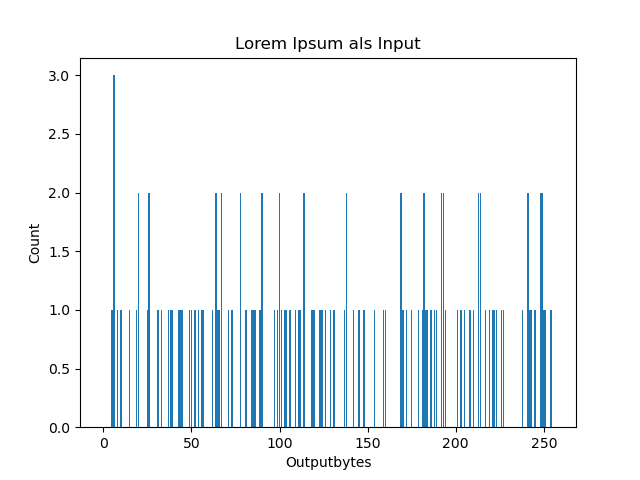
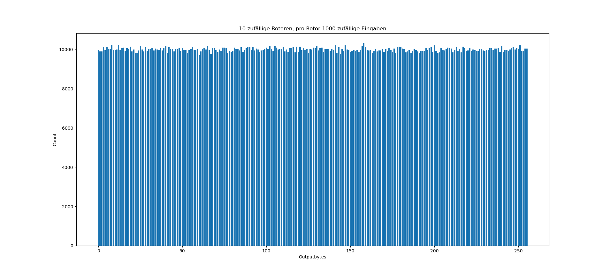
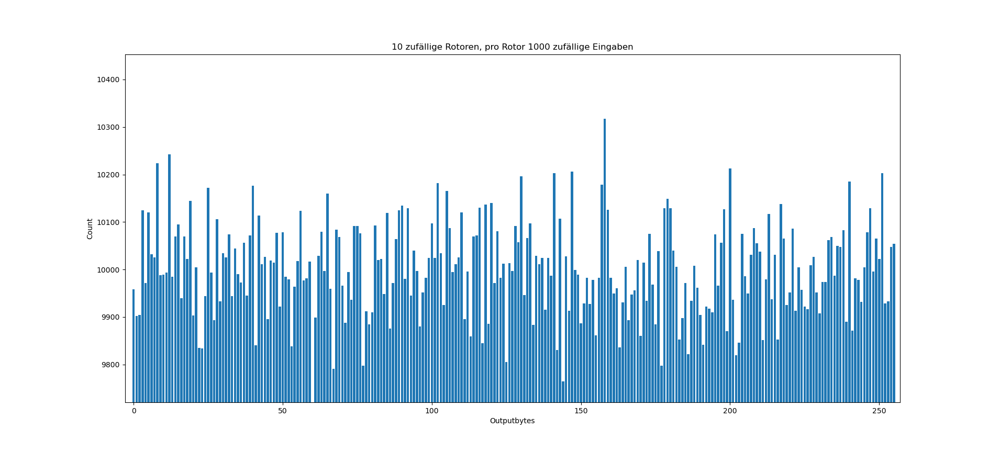

# Bytenigma Aufgabe 2

##### Inhaltsverzeichnis

## Indistinguishability
Die Indistiguishability ist sehr schlecht, insbesondere wenn es nur einen Rotor gibt der besonders schwach ist.
Ein schwacher Rotor wäre zum Beispiel einer, bei dem 0-255 der richtigen Reihenfolge nach geordnet sind.
Bei einem Rotor solch einer Konfiguration und einer Einabe von 255 Null-Bytes wird ein klares pattern sichtbar:

    fffdfbf9f7f5f3f1efedebe9e7e5e3e1dfdddbd9d7d5d3d1cfcdcbc9c7c5c3c1bfbdbbb9b7b5b3b1afadaba9a7a5a3a19f9d9b99979593918f8d8b89878583817f7d7b79777573716f6d6b69676563615f5d5b59575553514f4d4b49474543413f3d3b39373533312f2d2b29272523211f1d1b19171513110f0d0b0907050301fffdfbf9f7f5f3f1efedebe9e7e5e3e1dfdddbd9d7d5d3d1cfcdcbc9c7c5c3c1bfbdbbb9b7b5b3b1afadaba9a7a5a3a19f9d9b99979593918f8d8b89878583817f7d7b79777573716f6d6b69676563615f5d5b59575553514f4d4b49474543413f3d3b39373533312f2d2b29272523211f1d1b19171513110f0d0b0907050301

Dadurch kann klar von solch einer Eingabe im Vergleich zu einem zufälligen Input unterschieden werden.
Auch ein Avalanche-Effekt ist bei der gegebenen Chiffre nicht vorhanden, denn die Änderung eines Bytes in der Eingabe hat weder Einfluss auf den Ciphertext der vorherigen Bytes noch auf den der nachfolgenden Bytes.
Ein Angreifer könnte diesen Umstand außerdem bei einem Chosen-Plaintext-Angriff nutzen, da er durch diese Ausgabe bei einer Eingabe von nur Null-Bytes darüber Rückschlüsse ziehen kann, dass die Rotorwerte nicht komplett zufällig sondern in einer gewissen Reihenfolge angeordnet werden müssen.

## Bias

Es sind nicht alle Werte gleich wahrscheinlich. So kann der Ciphertext eines Bytes nicht dasselbe Byte sein, das das Plaintextbyte war.
Denn wenn das Byte den "Hinweg" durch die Rotoren abgeschlossen hat, muss es denselben "Rückweg" nehmen, um bei dem Ausgangsbyte wieder anzukommen.
Allerdings gibt es bei der Komplementbildung keine Möglichkeit, dass das Komplement eines Byte dasselbe Byte ist. Dadurch kann der "Rückweg" nie derselbe sein wie der "Hinweg".

## Histogrammanalyse

Durch die Erstellung von Histogrammen für verschiedene Rotor- und Plaintextwerte sollen mögliche Schwächen der Chiffre erfasst werden.

Für die Eingabe von einem normalen, lesbaren lateinischen Text ist erkennbar, dass der Ciphertext absolut nicht zufällig verteilt und somit nicht indistinguishable ist.

Bei zufällig generierten Rotoren und zufällig generierten Inputwerten wird ein Bias sichtbar. Die Ciphertextwerte variieren sehr stark, manche Bytes kommen überhaupt nicht vor.

Bei dem unteren Bild handelt es sich um ein Close-Up des oberen Bildes.

## Schlüsselraum

Sei n die Anzahl an Rotoren. 
Für jeden einzelnen Rotor gibt es 256! Möglichkeiten, den Rotor zusammenzusetzen. 
Theoretisch ergibt sich bei n Rotoren so ein Schlüsselraum von ld(256! ** n) Bit, also bereits bei einem Rotor ein größerer Schlüsselraum als bei AES-256.
Allerdings ändert das nichts an den anderen Schwachstellen, über die die Chiffre verfügt.

### Rotoren zusammenfassen

Zudem hängt der Schlüsselraum auch nur bedingt von der Anzahl an Rotoren ab. 
Die Länge des Plaintext hat auch einen direkten Einfluss auf den Schlüsselraum.
Denn, wenn zum Beispiel der Plaintext nur 255 Byte oder weniger lang ist, können mit Sicherheit alle Rotoren hinter dem zweiten mit dem zweiten Rotor zusammengefasst werden, denn sie rotieren bei kürzeren Eingaben nie. Das skaliert natürlich auch bei größeren Eingaben, sodass lediglich die Rotoren weiter hinten zusammengefasst werden können.
So kann zum Beispiel: [4 -> 5, 5 -> 77, 77 -> 133] zu [4 -> 5, 5 -> 133] zusammengefasst werden. Problematisch wird diese Zusammenfassung lediglich bei einem Überlauf, bei dem man entsprechend auch die hinteren Rotoren zum rotieren bringen kann. Allerdings hat man dann die Möglichkeit, die Rotoren vor und nach dem Überlauf des ersten Rotors zusammenzufassen.

Jedoch gibt es auch bei mehreren Rotoren die Möglichkeit, alle Rotoren für 256 Bytes an Eingabe zusammenzufassen, und zwar indem man vorher absichtlich für einen Überlauf im ersten Rotor sorgt und dadurch garantieren kann, dass die die hinteren Rotoren für die nächsten 256 Eingabebytes nicht rotieren. Das kann erreicht werden, indem man mit den Eingabewerten schritt für schritt mit jeder Umdrehung um 1 niedriger geht, und damit sozusagen die Rotation des ersten Rotors verfolgt. Der erste Rotor hat somit immer denselben Ausgabewert, die Gesamtkonstruktion deshalb auch. Allerdings nur bis zu dem Punkt, an dem der erste Rotor überläuft. Dann rotiert der zweite Rotor, wodurch das Ergebnis in den nächsten Schritten anders ist. Somit hat man ab dann eine Garantie, dass sich der zweite Rotor für die nächsten Eingabebytes nicht mehr drehen wird.

### Komplemente in Rotoren

Zudem wird der Schlüsselraum noch dadurch halbiert, dass ein Rotor und einer, dessen jeder Wert komplementiert ist, äquivalent sind. Denn (Man nehme zur Konzeptionalisierung einen 3-Bit Rotor an und kürze für das Beispiel irrelevante Transformationen):

    [4 -> 5]            [4 -> 2]
    ...         =====   ...
    [7 -> 2]            [7 -> 5]

    (4 wird zu 7)       (4 wird zu 7)

Man kann also Komplemente miteinander vertauschen.

### Gerade und ungerade Werte in Rotoren

Auch die Anordnung von geraden und ungeraden Werten in Rotoren hat einen direkten Einfluss auf den Ciphertext.
Wenn die Rotorwerte abwechselnd gerade und ungerade sind, entstehen bei einer Eingabe von Nullbytes auch ausschließlich gerade oder ungerade Ciphertextwerte.
Bei einem Chosen-Plaintext-Angriff kann ein Angreifer diesen Umstand nutzen, da er dadurch Rückschlüsse auf den Rotor im Sinne von der Abwechslung von geraden und ungeraden Werten ziehen kann, wodurch der Schlüsselraum weiter eingeschränkt wird.

